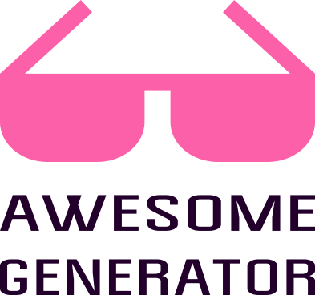

# Awesome generator



[](https://goreportcard.com/report/github.com/orsinium/awesome-generator) [](https://github.com/orsinium/awesome-generator) [](LICENSE)

Generate awesome list for any language over [Github search API](https://developer.github.com/v3/search/#search-repositories).

Generated awesome lists: [generated-awesomeness](https://github.com/orsinium/generated-awesomeness).


## Installation

[Download](https://github.com/orsinium/awesome-generator/releases) binary for latest release or install from source:

```bash
go get github.com/orsinium/awesome-generator
cd $GOPATH/src/orsinium/awesome-generator
```


## Usage

Generate awesome list for language:

```bash
go run awesome.go -l python > python.md
```

Generate awesome list for topic:

```bash
go run awesome.go -t docker > docker.md
```

If you're download binary release then use it instead of `go run awesome.go`:

```bash
./linux-amd64.bin -t docker > docker.md
```


## Advanced usage

Save projects to JSON:

```bash
go run awesome.go -l python --json > python.json
```

Generate awesome list from JSON:

```bash
cat python.json | go run awesome.go > python.md
```


## Command line arguments

* `-l` -- language. `go run awesome.go -l python`
* `-t` -- topic. `go run awesome.go -t docker`
* `--json` -- dump projects to json. `go run awesome.go -l python --json`
* `--pages` -- count of pages (default 10). `go run awesome.go -l python --pages 5`
* `--min` -- minimum projects into one section (default 2). `go run awesome.go -l python --min 3`
